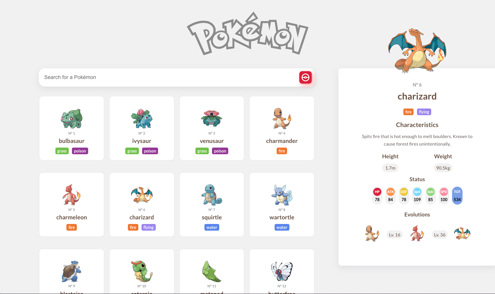

# Pokédex App

Uma Pokédex interativa desenvolvida com React, que permite aos usuários buscar e visualizar detalhes de Pokémons em tempo real. A aplicação consome dados diretamente da PokeAPI e oferece uma navegação fluida com scroll infinito e carregamento progressivo.

## 🚀 Demonstração

**Live:** https://pokedex-eight-pink.vercel.app  
**Repositório:** [github.com/gabriel-valino/pokedex](https://github.com/gabriel-valino/pokedex)



## 🧪 Tecnologias Utilizadas

- React
- TypeScript
- React Query
- Axios
- Styled Components
- React Hook Form
- Zod
- PokeAPI

## 📦 Instalação

```bash
git clone https://github.com/gabriel-valino/pokedex.git
cd pokedex
npm install
npm run dev
```

## ✨ Funcionalidades

- Busca por nome de Pokémon
- Exibição de dados detalhados (nome, tipo, imagem, stats)
- Scroll infinito com carregamento automático
- Validação de busca com Zod
- Design responsivo

## 📚 Desafios Técnicos

Consumir a PokeAPI exigiu lidar com paginação, chamadas aninhadas e estrutura de dados complexa. A implementação do scroll infinito com React Query exigiu controle detalhado sobre o cache, parâmetros de página e gerenciamento de carregamento.

## 🧠 O que aprendi

- Paginação avançada com React Query e APIs públicas
- Validação de formulários com Zod e React Hook Form
- Criação de componentes reutilizáveis e isolados
- Manipulação de estados complexos e dados assíncronos
- Integração com APIs REST externas
